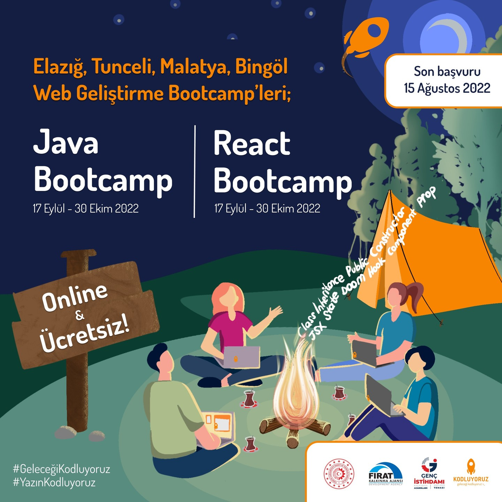

## **This archive contains all the works I have done in React Bootcamp, organized in cooperation with [Fırat Development Agency](https://fka.gov.tr) and [Kodluyoruz](https://kodluyoruz.org/tr/kodluyoruz/).**

 
<h2> WEEK - 1 - Cookies and Session Storage </h2>
<h2> WEEK - 2 - <li> HTML Status Codes </li>  </h2>
<h2>         <li>  HTTP Request Methods </li> </h2>
<h2>         <li>  Fetch API Method </li> </h2>
<h2>         <li>  Sort Method And Pagination </li> </h2>
<h2> WEEK - 3 - <li>Edit, Pagination and Sorting </li> </h2>
<h2>        <li>Light/Dark Theme with Context Api</li> </h2>
<h2>        <li>JavaScript Custom Event</li> </h2>
<h2> WEEK - 4 - <li>Pages with React Router DOM v6 </li> <h2>
<h2>        <li>Light/Dark Theme with Context Api</li> </h2>
<h2> WEEK - 5 - useMemo & useCallback  <h2>
